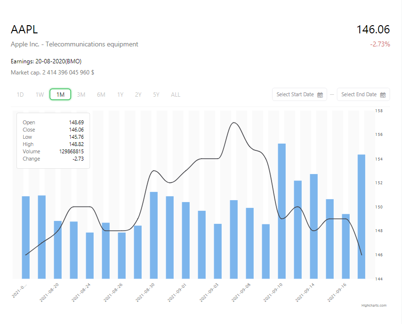

#Big Data Charts React App
---

---
###Setup instruction
_At first you need to install project with all dependencies_
>  npm install

Or

> yarn install

_This command will install all dependencies and  create  folder_ **node_modules**

After that you need to create in root dirictory **.env** file with _secret_key_

> REACT_APP_IEXCLOUD_KEY=_my_secret_public_key_

That is it!

---

Next you just have to start project with command bellow

> npm run dev

OR

> yarn dev

---

Author of project: __Vladimir Bajenov__

bajenovcpm433@yandex.ru

